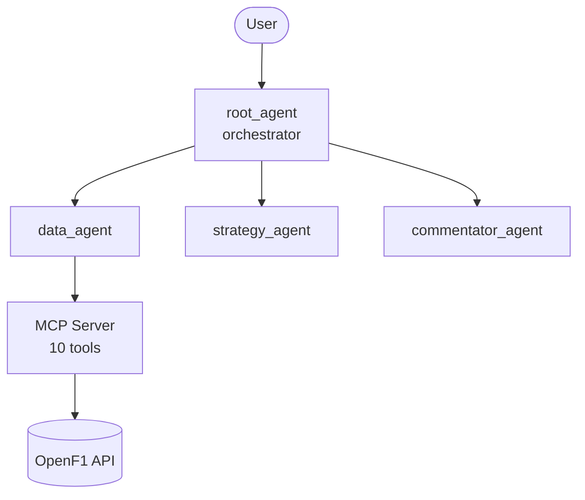

# Pit Wall Co-Pilot

An F1 strategy analyst agent that answers natural-language questions about races that have already happened, grounded entirely in real session data — no predictions, no guessing, just analysis of what the data actually shows.

**Track:** Agents for Business
**Built for:** AI Agents: Intensive Vibe Coding Capstone Project (Kaggle x Google)

## The problem

Reviewing whether a pit call, tire choice, or safety car reaction was the right one normally means manually digging through lap times, pit logs, and race control messages — slow, and it requires real F1 strategy knowledge to interpret correctly. Teams do this kind of debrief after every race, because bad strategy calls cost real points and prize money in a championship fight. Pit Wall Co-Pilot turns that manual review into a conversation: name a race, ask what you want to know, get an answer grounded in the actual data from that session.

## Why an agent

A static dashboard can show you the numbers. It can't tell you that a 35-second "pit stop" on lap 67 wasn't really a pit stop at all, it was a car parked during a red flag — or notice that two separate safety car periods both coincided with a flurry of pit activity. That requires reasoning over multiple data sources at once and explaining the *why*, not just the *what*. That's the gap an agent fills.

## Architecture

Four agents, one MCP server, ten tools:

- **`root_agent` (orchestrator)** — doesn't fetch or analyze anything itself; decides which specialists a question needs and assembles their answers.
- **`data_agent`** — the only agent with tools. Calls the MCP server for raw facts and reports them as-is, no interpretation.
- **`strategy_agent`** — takes the data `data_agent` gathered and reasons about whether strategy calls were good ones, citing specific numbers.
- **`commentator_agent`** — turns the strategy analysis into a short, readable briefing.

`data_agent`'s tools live in a custom MCP server (`mcp_server/server.py`) that wraps the [OpenF1 API](https://openf1.org/) — free, no authentication required for historical session data. Ten tools cover sessions, drivers, race results, lap times, pit stops, tire stints, weather, team radio activity, race control events (flags, safety cars, red flags), and championship standings.

Good catch raising that — given you couldn't actually see the earlier diagram properly when I first made it, asking you to screenshot something you couldn't read isn't useful. Better fix: skip the screenshot entirely and use a Mermaid diagram instead — GitHub renders these as actual diagrams automatically when someone views the README in a browser, no image file needed at all.

Add this to the README, replacing the plain-text architecture description (or right alongside it):

````markdown

````

Paste that whole block, fences included, into the README under the Architecture heading. GitHub turns it into a real boxes-and-arrows diagram on its own once it's pushed — nothing to screenshot, nothing that depends on a chat widget rendering correctly on your end.

## Key concepts demonstrated

| Concept | Where |
|---|---|
| Multi-agent system (ADK) | `pitwall_agent/agent.py` — orchestrator + 3 sub-agents via `AgentTool` |
| MCP Server | `mcp_server/server.py` — custom server, 10 tools, built from scratch |
| Security | System-instruction guardrails in every agent: never state a fact that didn't come from a tool call, never invent a tool that doesn't exist |
| Antigravity | Built using Antigravity's Agent Manager and a workspace Rule (`.agents/rules/project-guide.md`) steering the build |

## Setup

```bash
git clone https://github.com/mehta1351/pitwall-copilot.git
cd pitwall-copilot
python -m venv .venv
source .venv/bin/activate   # Windows: .venv\Scripts\activate
pip install -r requirements.txt
```

Get a free Gemini API key from [Google AI Studio](https://aistudio.google.com/apikey) and put it in `pitwall_agent/.env`:


Run it:
```bash
adk web
```
Open the URL it prints, select `pitwall_agent`, and ask something like *"what were the pit stops during the Monaco Grand Prix"* or *"was there a safety car in the last race."*

## Known limitations

- Team radio coverage dropped sharply starting in 2026 on OpenF1's side — `get_team_radio` will often return empty, which the agent treats as normal, not an error.
- Each tool inspects one session at a time; there's no built-in way to scan an entire season in one query.
- Runs on the Gemini API free tier, which carries daily request limits — heavy testing in a short window can hit those.